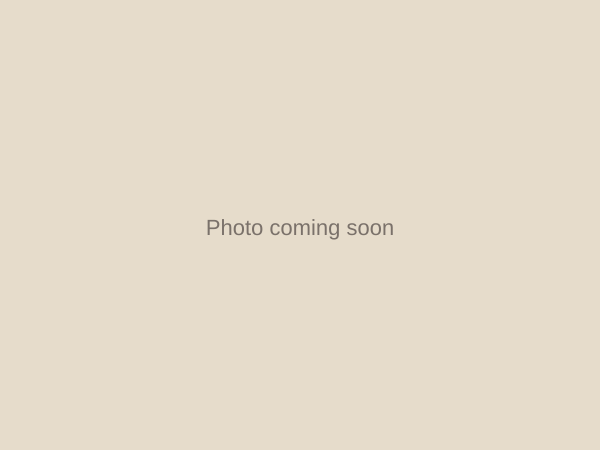

# Juno Bug Pottery — Website Guide

This is my living reference doc for how my website works. Whenever I want to
make a change and don't remember how, I read this file first (or hand it to
Claude and ask). Claude should keep this file up to date as we make changes.

Last updated: 2026-08-03

## Photos

- Gallery photo boxes are fixed squares that show the **whole photo, never
  cropped** (`object-fit: contain` in `css/style.css`), with letterboxing in
  a soft background color for photos that aren't square. This works whether
  a photo comes from a phone (portrait) or a proper camera (landscape).
- Camera photos (e.g. a Fujifilm X100VI export) can be 30+ megapixels and
  ~4MB each — far bigger than a website needs. Claude resizes these down to
  a 1600px-long-edge JPEG before adding them to a category page. The
  full-resolution originals (filenames like `DSCF1234.jpeg`) and any photo
  export `.zip` files are excluded from git via `.gitignore` — they stay in
  this Dropbox folder as your archive, but never get pushed to GitHub.
- If a batch of new photos includes several near-duplicate angles of the
  same piece, Claude will pick the best 1–2 for the gallery rather than
  adding every angle — just ask if you want more of a particular piece added.

## Current look

- Background: soft orange/peach, with a very faint blue autumn leaf/flower
  line pattern tiled behind everything (`images/pattern-leaves.svg`).
- Text and accents: deep blue. Colors live as CSS variables at the top of
  `css/style.css` — tell Claude to tweak them any time.
- Top banner blends 4 photos into one strip (feathered/masked edges so they
  crossfade into each other, not hard-edged tiles) — currently a butterfly
  bowl, a koi plate, a koi vase, and the palm-tree/dog canister. Defined by
  `.banner-photo` rules in `css/style.css`; swap the 4 `` tags in each
  page's `<div class="top-banner">` to feature different pieces.
- Logo: a ladybug design, transparent background, sitting in the header next
  to the site name. I design/edit it in `images/juno bug logo.pptx`
  (PowerPoint), export a full-slide screenshot PNG, and Claude crops it and
  removes the white background before it goes live as `images/logo.png`.
  Just save the new export anywhere in the project and tell Claude the
  filename — no need to crop it yourself.
- Homepage category buttons each have their own faint two-color autumn
  gradient (defined in `css/style.css` under `.cat-mugs`, `.cat-bowls`, etc.)

## The big picture

- The site is a **plain static website** — just HTML, CSS, and image files.
  No database, no e-commerce, no build tools.
- It's a **photo gallery only**. Visitors browse pottery by category. To buy,
  they click through to my Etsy and/or Felt shop.
- It's hosted for **free on GitHub Pages**, with my own domains
  (`junobug.com` and `junobug.co.nz`, bought on GoDaddy) pointed at it.
- Why this instead of Squarespace: no monthly fee, and Claude can build/edit
  it directly. The tradeoff I accepted: adding new photos means a short git
  workflow (below) instead of a drag-and-drop editor.

## Current status

- [x] Site pages built locally (2026-07-26)
- [x] Local git repo created (2026-07-26)
- [x] Pushed to GitHub (2026-07-26)
- [x] Logo added to header (2026-07-26)
- [x] Site restyled — soft orange background, blue writing (2026-07-26)
- [x] GitHub Pages turned on, custom domain DNS verified (2026-07-26) —
      TLS/HTTPS certificate provisioning automatically (takes up to ~15 min,
      sometimes longer)
- [x] junobug.com DNS records added at GoDaddy (2026-07-26)
- [ ] junobug.co.nz forwarding to junobug.com set up at GoDaddy
- [x] Real photos added — all 6 categories (2026-07-26)
- [ ] Etsy shop link added
- [ ] Felt shop link added

*(Claude: tick these off and update the date above as we complete each step.)*

## Folder structure

```
Juno Bug Pottery/
├── index.html          ← home page
├── mugs-cups.html       ← one page per category
├── bowls.html
├── plates.html
├── vases.html
├── canisters.html
├── tiles.html
├── css/
│   └── style.css        ← all the styling, shared by every page
├── images/
│   ├── placeholder.svg   ← "photo coming soon" graphic
│   ├── mugs-cups/        ← put mug/cup photos here
│   ├── bowls/             ← put bowl photos here
│   ├── plates/
│   ├── vases/
│   ├── canisters/
│   └── tiles/
└── WEBSITE-GUIDE.md      ← this file
```

## How to add a new pottery photo (easy way — do this)

1. Take/export the photo. Keep the file size reasonable (under ~1–2 MB —
   resize/compress if your camera photos are huge).
2. Drop the photo file into the right category folder, e.g. `images/bowls/`
   for a bowl. Use a simple lowercase name with no spaces,
   e.g. `blue-speckled-bowl.jpg`.
3. Open the `captions.txt` file in that same folder (e.g.
   `images/bowls/captions.txt`) and add one line per photo:
   ```
   blue-speckled-bowl.jpg | Blue speckled bowl, 20cm
   ```
4. Repeat for as many photos as you like, in any/all category folders.
5. Tell Claude "I've added photos, please publish them." Claude will read
   the `captions.txt` files, add the gallery entries, and push the site live.

To remove a photo, delete its line from `captions.txt`, delete the image
file, and ask Claude to publish the change.

## How to add a photo (manual way — optional, for hands-on editing)

Skip this unless you want to edit the HTML yourself.

1. Open the matching page (e.g. `bowls.html`) in a text editor (VS Code).
2. Find the `<div class="photo-grid">` section. Copy one whole block that
   looks like this:
   ```html
   <figure>
     
     <figcaption>Example bowl — replace this photo and caption</figcaption>
   </figure>
   ```
3. Paste a new copy just before the closing `</div>`, then edit the `src`,
   `alt`, and `<figcaption>` text.
4. Save, then publish the change (see "Publishing changes" below).

## Adding a whole new category

1. Copy an existing page, e.g. `bowls.html`, and rename the copy
   (e.g. `planters.html`).
2. Create a matching folder: `images/planters/`.
3. In the new page, change the `<title>`, the `<h1>`, and remove the example
   placeholder `<figure>` blocks once you have real photos.
4. In **every** page's `<nav class="site-nav">` list (including `index.html`),
   add a matching `<li><a href="planters.html">Planters</a></li>` line.
5. On `index.html`, also add a matching card in the `<section class="category-grid">`.
6. Publish the change (see below).

## Previewing changes before publishing

Double-click any `.html` file (e.g. `index.html`) to open it in your browser
and see your changes. This works entirely offline — nothing goes live until
you publish.

## Publishing changes (pushing to GitHub)

Every time you want your changes to appear on junobug.com, run these three
commands from this folder in a terminal:

```
git add .
git commit -m "describe what you changed, e.g. add new bowl photos"
git push
```

GitHub Pages picks up the change automatically — it usually shows up on the
live site within a minute or two.

## Troubleshooting

- **`git commit` fails with "unable to write new index file"**: this folder
  lives inside Dropbox, and Dropbox sometimes briefly locks files while it's
  uploading them (especially right after adding several photos at once).
  Wait 10–20 seconds and try the commit again.
- **A file edit seems to silently revert** (e.g. an image goes back to an
  older version moments after being saved): also Dropbox — it can sync an
  older cached copy back over a freshly-written file. Fix: re-save the file,
  then immediately check its checksum (`md5sum path/to/file`) matches what
  was just written before staging it, and commit right away rather than
  leaving a gap where Dropbox can intervene.

## GitHub account details

- GitHub sign-in email: sanet@lonrix.com
- GitHub username: Sanet1313
- Repository name: juno-bug-pottery
- Repository URL: https://github.com/sanet1313/juno-bug-pottery

## Domains

- junobug.com — bought on GoDaddy
- junobug.co.nz — bought on GoDaddy
- DNS setup notes: *(to fill in once we configure this)*

## Shop links

- Etsy shop URL: not set up yet. The "Shop on Etsy" button currently shows a
  popup saying "This account is not yet active" instead of linking anywhere
  (see the `onclick` on that button in each page). Once the Etsy shop is
  live, give Claude the URL and ask it to swap the button back to a real link.
- Felt shop URL: https://felt.co.nz/shop/junobugpottery (live on all pages
  since 2026-08-06, opens in a new tab)

Once I have the Etsy URL too, update the `href="#"` placeholder on the
"Shop on Etsy" button the same way.

## Categories

Mugs & Cups, Bowls, Plates, Vases, Canisters, Tiles
